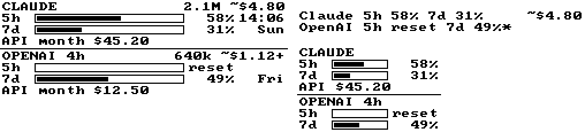

# AI usage widget

The **AI usage** widget shows how much of your Claude and ChatGPT/Codex allowance you have used, today's tokens with an estimated cost, and the billed API cost this month.



For each provider the full view shows:

- **Header:** today's tokens and their estimated cost at public API prices (`~$4.80`). A `+` means some models have no known price, so the figure is a lower bound.
- **Quota bars:** subscription windows such as `5h` and `7d`, with the used share and the local reset time (`14:20` within a day, otherwise the weekday). After a window resets it reads `reset` until the next report arrives.
- **`API month`:** the billed API cost this calendar month (UTC), from the provider's Admin API.

When the last quota report is more than an hour old, its age follows the provider name (`OPENAI 4h`), or a `*` in the condensed view. A widget shorter than the full view falls back to one line per provider. In the layout editor, choose **One line per provider** to force the condensed view.

## Where the numbers come from

Each AI provider exposes usage differently, and subscription plans have no public usage API. The widget therefore combines two sources:

| Data | Source | Needs a running computer? |
|---|---|---|
| Claude Pro/Max quota (5-hour, 7-day) | Claude Code passes `rate_limits` to its [status line](https://code.claude.com/docs/en/statusline#rate-limit-usage) command; the collector sends it on | Only to *update* it |
| ChatGPT/Codex quota (5-hour, weekly) | `rate_limits` in Codex session files (`~/.codex/sessions`) | Only to *update* it |
| Tokens today from Claude Code and Codex | Local session files, read by the collector | Only to *update* them |
| Organization API tokens today and billed cost this month | [Anthropic Usage & Cost API](https://platform.claude.com/docs/en/manage-claude/usage-cost-api), [OpenAI Usage API](https://platform.openai.com/docs/api-reference/usage), polled by the server | **No** |

### Available without the computer running

The server **stores the last report** from each computer, so the display keeps rendering when the computer is off. The widget never invents current values:

- A quota window whose reset time has passed shows `reset`, not the old percentage. Without a newer report, current use is unknown. For a rolling window it can only be what was used since the reset.
- "Today" counts only reports for the current day in the display time zone. After midnight the stale figures disappear.
- Admin API figures are fetched by the server on every display refresh (cached for 5 minutes), independent of any computer.

Subscription quota only changes when you use the service. The collector reports whenever Claude Code or Codex runs on any of your computers, so its figures are current exactly when they move. The exception is use outside the CLIs: claude.ai, the Claude apps, and ChatGPT on the web or mobile. That use counts toward the account-wide percentages but is not reported until the next CLI report.

**Not supported on purpose:** some community tools poll an undocumented OAuth endpoint (the one behind Claude Code's `/usage`) to read quota without a CLI running. This app does not. That would mean storing a token with full access to your account on a server, the endpoint is unsupported and changes without notice, and users report persistent rate limiting on it ([anthropics/claude-code#30930](https://github.com/anthropics/claude-code/issues/30930)). An official endpoint has been requested ([#99231](https://github.com/anthropics/claude-code/issues/99231)). If one ships, the server can poll it like the Admin APIs.

The same applies to the probe approach used by devices such as [claude-usage-stick](https://github.com/oauramos/claude-usage-stick): it sends a 1-token Messages request with a `claude setup-token` OAuth token and reads the `anthropic-ratelimit-unified-5h/7d-*` response headers. Anthropic's terms allow OAuth tokens from Free, Pro and Max plans only in Claude Code and claude.ai, so using one from another tool or server is not permitted. The status line route above uses the same quota data, delivered by Claude Code itself.

## Setup

Apply migration `024_ai_usage.sql` first. Then open **Integrations → AI usage**:

1. Choose **Create token**. It is shown once; only a SHA-256 hash is stored.
2. On each computer where you use Claude Code or Codex, install the collector. The collector is written in TypeScript and needs Node.js 22.18 or newer, which runs `.ts` files directly. There is no build step and there are no dependencies:

   ```sh
   git clone --depth 1 https://github.com/scottlinddk/ESP32-e-ink-system.git ~/.local/share/esp32-eink
   node ~/.local/share/esp32-eink/tools/ai-usage-collector/collector.ts init \
     --url https://YOUR-DISPLAY-HOST/api/ai-usage/ingest \
     --token eau_… --machine laptop --timezone Europe/Copenhagen
   node ~/.local/share/esp32-eink/tools/ai-usage-collector/collector.ts push
   ```

   Use the display's time zone, so "today" matches the panel. The config file is written to `~/.config/ai-usage-collector/config.json` with owner-only permissions. Environment variables `AI_USAGE_URL`, `AI_USAGE_TOKEN`, `AI_USAGE_MACHINE` and `AI_USAGE_TIMEZONE` override it. Use `push --dry-run` to see exactly what would be sent.
3. Schedule `push` every 15 minutes. It reports tokens for both tools and the Codex quota:
   - Linux: `crontab -e` and add `*/15 * * * * node ~/.local/share/esp32-eink/tools/ai-usage-collector/collector.ts push >/dev/null 2>&1`
   - macOS: a LaunchAgent with `StartInterval` 900. The card shows a complete plist.
   - Windows: `schtasks /Create /SC MINUTE /MO 15 /TN "AI usage collector" /TR "node %USERPROFILE%\.local\share\esp32-eink\tools\ai-usage-collector\collector.ts push"`
4. For Claude quota, add the status line to `~/.claude/settings.json`:

   ```json
   { "statusLine": { "type": "command", "command": "node ~/.local/share/esp32-eink/tools/ai-usage-collector/collector.ts statusline" } }
   ```

   It prints `5h 58% | 7d 31%` and sends the quota at most once a minute, or every 10 minutes when unchanged. It never fails the status line. If you already have a status line script, pipe its stdin JSON to `collector.ts statusline --quiet` from that script. Claude Code only includes `rate_limits` on Pro/Max plans, after the session's first response, and drops a window once it resets.
5. Optional: save **Admin API keys** for server-side organization usage. Anthropic keys start with `sk-ant-admin` ([how to create](https://platform.claude.com/docs/en/manage-claude/admin-api-keys)); only organization admins can create them, and **individual accounts have no Admin API**. OpenAI Admin keys start with `sk-admin-` and are created by an organization Owner. Regular API keys are rejected because they cannot read usage. Keys are stored encrypted with `ENCRYPTION_KEY`, like other credentials.
6. Choose **Test now**, enable **Show AI usage on the display**, save, and add **AI usage** in the layout editor.

**Upgrading from `collector.mjs`:** the collector was ported to TypeScript. Existing cron jobs, LaunchAgents and status lines that call `collector.mjs` keep working after `git pull` through a small compatibility entry point, as long as Node.js is 22.18 or newer. Switch them to `collector.ts` when convenient. On older Node.js the entry point prints a clear error, and the status line shows nothing.

Codex used through a ChatGPT plan is not API usage, so it never appears in the OpenAI Admin API. Claude Code used with an organization API key appears in both the local files and the Admin API. If you use both sources for the same usage, today's tokens are counted twice. In that case, run the collector with `--only codex`, or do not save the Anthropic Admin key.

## Estimated cost

The `~$` figure prices today's tokens with the public list prices in `backend/src/aiUsage/pricing.ts`: input, output, cache reads, 5-minute cache writes (1.25× input) and 1-hour cache writes (2× input; Claude Code uses these). On a Pro/Max or ChatGPT plan you pay a flat fee. The estimate shows what the same work would cost through the API, not what you are billed. Models missing from the table are counted in tokens but not priced. Claude prices were checked against Anthropic's pricing on 2026-10-07. The OpenAI prices came from third-party summaries because the OpenAI pricing page could not be reached at the time; verify them before relying on OpenAI estimates.

The `API month` figure is the providers' own cost report, not an estimate.

## Privacy

The collector sends only: a machine name, the local date, per-model token counts, and quota percentages with reset times. Prompts, responses, tool output, file paths, project names and session IDs never leave the computer. The collector reads only files modified within the last day. The server stores the last report per computer, at most 6 computers and 12 models per provider; extra models are summed as `other`.

## HTTP contract

`POST /api/ai-usage/ingest` with `Authorization: Bearer eau_…` (the integration token, never a sign-in token) and a JSON body of at most 10 KB:

```json
{
  "machine": "laptop",
  "providers": {
    "claude": {
      "limits": {
        "observed_at": "2026-10-07T09:58:00Z",
        "windows": [
          { "window_minutes": 300, "used_percent": 58, "resets_at": "2026-10-07T12:00:00Z" },
          { "window_minutes": 10080, "used_percent": 31, "resets_at": "2026-10-12T08:00:00Z" }
        ]
      },
      "usage": {
        "day": "2026-10-07",
        "models": [
          { "model": "claude-opus-5-5", "input_tokens": 140, "output_tokens": 100178,
            "cache_write_tokens": 308675, "cache_write_1h_tokens": 308675, "cache_read_tokens": 16307269 }
        ]
      }
    },
    "openai": { "usage": { "day": "2026-10-07", "models": [] } }
  }
}
```

- `machine` is optional (default `default`): 1–32 lowercase letters, digits, `-` or `_`.
- Each provider (`claude`, `openai`) may send `limits`, `usage` or both. Unknown fields are rejected.
- `limits.windows`: 1–4 windows with distinct lengths. `window_minutes` up to 31 days; lengths a minute or two short of whole hours or days are labelled as such (Codex reports 299 and 10079). Timestamps are UTC (`…Z`). `observed_at` may be at most 5 minutes in the future. The newest `observed_at` wins across machines.
- `usage.day` is the collector's local date, compared with today in the display time zone. `models` has at most 12 entries. Counts are whole numbers. `input_tokens` excludes cache reads and writes, and `cache_write_1h_tokens` is the part of `cache_write_tokens` with a 1-hour lifetime. Each machine's usage replaces its previous report.

Responses: `200` with the machine and providers stored, `400` with an `error` message for an invalid body, `401` for a missing, invalid, revoked or replaced token. Replacing or revoking the token clears all stored reports.

Signed-in endpoints: `GET /api/ai-usage` (status: token, last reports per provider and machine, which Admin keys are saved), `POST`/`DELETE /api/ai-usage/token`, `PUT`/`DELETE /api/ai-usage/admin-keys/{claude|openai}` with `{ "api_key": "…" }`, and `POST /api/ai-usage/test` (builds the widget data now, bypassing the Admin API cache; 3 per minute).
