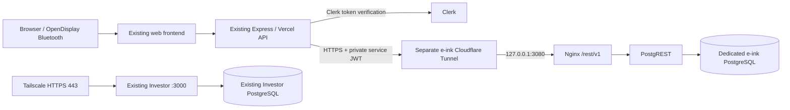

# Move the e-ink database to the Raspberry Pi

Reviewed 2026-09-28 against e-ink `origin/main` at `2cffedd` and Investor
`origin/main` at `605e9df`, including its managed updater. These are repository findings, not a live inventory of
the Pi or Supabase. No production data, DNS, Vercel settings or Pi services
were changed while preparing this package.

> **Update 2026-09-29: no source database.** The hosted Supabase project has been
> deleted and its data cannot be recovered. The Pi database therefore starts empty.
> Follow [Fresh start](#fresh-start-no-source-database) and skip every step marked
> "source only". The export/import tooling is kept for anyone who still has a live
> source database.

## Decision and scope

This is a deployment package, not an executed production migration. The owner
confirmed a **Raspberry Pi 4B with 4 GB RAM and a 500 GB SSD**, a **Vercel** backend
and a **Cloudflare-managed domain** on 2026-09-28. On 2026-09-29, the owner
specified SSH destination **`scott@rpi-srv.local`**, verified its ED25519 host-key
fingerprint **`SHA256:dZF+gSvd4h9teswqBSLTMKpjw4Eu/QkB4Z5gXTNsaY0`**, and
approved **`eink-db.scottlind.dk`** for the database API. The live OS, SSD
mount/UUID, free capacity and available memory still need verification.
Only the database moves; the frontend/backend stay on Vercel.

Keep the frontend and Express backend on Vercel, keep Clerk authentication, and replace the
hosted Supabase database API with **PostgreSQL + PostgREST + a small Nginx
gateway** on the Pi. Use a dedicated HTTPS hostname through a separate outbound
Cloudflare Tunnel at `eink-db.scottlind.dk`. Check for an existing conflicting DNS
record before creating the tunnel route; PostgreSQL itself has no published port.



The database client in `backend/src/services/database.ts` uses table CRUD and
PostgREST query features. It does not use Supabase Auth, Realtime, Storage SDK
or Edge Functions. The existing Supabase SDK therefore remains useful: change
`SUPABASE_URL` to the new **origin without `/rest/v1`** and replace
`SUPABASE_SERVICE_ROLE_KEY` with the generated Pi JWT. The gateway strips the
SDK's `/rest/v1/` prefix. No frontend connection string or firmware change is
needed. Provider APIs, Clerk, GitHub firmware downloads and optional Upstash
rate limiting remain external dependencies.

A full Supabase stack adds services this app does not currently use. A direct
PostgreSQL adapter would require replacing the query layer and arranging a
secure database transport from Vercel. The smaller compatible API is the chosen
scope. This is not a complete self-hosted Supabase installation.

## Investor coexistence requirements

Confirm these against the running host before executing setup:

| Existing Investor deployment | E-ink deployment rule |
| --- | --- |
| Compose project `investor`; database `investing`; API `127.0.0.1:3000` | Project `esp32-eink`, database `eink`, gateway `127.0.0.1:3080`; separate network and roles |
| Tailscale Serve owns HTTPS 443 and the origin root | Preserve all Serve/Funnel settings. Do not add routes or move Investor to a subpath |
| Investor first-start script rejects additional Tailscale listeners | Use the separate outbound tunnel; do not rerun Investor installation/startup as part of this migration |
| The managed updater rejects other containers mounting `/srv/investor/**` or `/etc/investor/**` | Use a real `/srv/esp32-eink/` outside those prefixes. A child directory under Investor still blocks its updates; a bind alias is not an acceptable workaround |
| The owner's documented Pi has a single-SSD installer adjustment; the legacy scripts assume a separate `/srv/investor` mount | Inspect the live layout. Set `STORAGE_MOUNT` and `STORAGE_UUID` explicitly; `/` is supported only when the root filesystem is the verified SSD |
| Docker's systemd drop-ins depend on Investor storage/update guards | Preserve them. Shared Docker, SSD failure and host reboot still affect both applications. Non-root e-ink mounts require an existing Docker mount dependency |
| Investor containers have 1,856 MiB of steady-state memory caps | E-ink adds 544 MiB of container caps plus a 256 MiB tunnel cap. Keep a separate 512 MiB allowance for one maintenance operation and 512 MiB host floor; validate actual headroom |
| Investor database/evidence backups run at 03:30 UTC with jitter | Separate e-ink backup job/lock, preferably 05:00 UTC or a measured quiet period; monitor I/O overlap |
| Investor warns at 20% free SSD and rejects uploads below 10% | Keep at least 20% free after data, dumps, export bundles, images and a restore rehearsal |

Investor's backup **does not back up e-ink data or secrets**. Never point these
scripts at Investor's configuration, database or storage directory. Do not run
Docker pruning, daemon restarts, filesystem changes or unscoped Compose commands.
Relevant evidence: Investor's `infra/docker-compose.yml`,
`infra/systemd/docker.service.d-investor.conf`, `infra/start-pi.sh`,
`infra/OPERATIONS.md`, `infra/update/platform.py`, `docs/pi-update-acceptance.md`
and `docs/remote-access.md` at the reviewed revision. The checked-out Investor
branch can be older than its deployed release; do not infer live state from it.

### Resource profile for the confirmed 4 GB Pi

| Component | Memory ceiling |
| --- | ---: |
| E-ink PostgreSQL | 384 MiB |
| E-ink PostgREST | 128 MiB |
| E-ink Nginx | 32 MiB |
| E-ink Cloudflare Tunnel | 256 MiB |
| E-ink migration client, only while used | 256 MiB |

The reference steady budget is **2,656 MiB** including Investor. Adding **512 MiB
for one maintenance operation** (such as Investor's migration or an e-ink recovery
database) and **512 MiB for host services** gives **3,680 MiB**. This is a planning
budget, not measured usage or a guarantee that every workload fits. Linux reports
less usable memory than the physical RAM label; preflight checks actual `MemTotal`,
`MemAvailable`, running container ceilings and usage, including other workloads.
Missing Investor services retain their planning allowance so a later start is
not mistaken for spare capacity. Swap is not counted as additional RAM.

This replaces the original 3.56 GiB *available-memory* requirement, which was
unsuitable for the shared 4 GB host. The new check also reserves growth to existing
container ceilings and live host headroom. Run it during representative Investor
activity. A refusal means investigate usage/scheduling before proceeding; it does
not authorize reducing Investor's limits.

PostgreSQL uses 64 MiB shared buffers, 2 MiB work memory, one autovacuum worker
with 16 MiB vacuum memory, 32 MiB maintenance memory and no parallel query workers.
PostgREST has three pooled connections; PostgreSQL permits 15 connections to leave
administrative room. These are starting settings for the small e-ink workload.
Keep durability settings enabled, and monitor memory, restarts, latency and vacuum
progress during rehearsal and normal use. Build images off the Pi where possible.
Do not overlap Investor updates/backups with e-ink migration, backup or recovery
work; the maintenance allowance covers one operation. Before a recovery drill,
measure headroom again or use a separate test host.

## Fresh start (no source database)

Use this path when there is no Supabase (or other) source to copy from. Storage
initialization applies every tracked SQL file, including both `002_*.sql`, and
creates empty tables, so the following are **not needed**: the source
`pg_service.conf` entry, `pgpass` source line, Supabase CA certificate, `inspect`,
`export`, `import`, `verify`, the migration tools image and the write freeze.
`migrate.py` hardcodes `sslmode=verify-full` for its source, so a CA file would be
mandatory if a source were ever used. The default firmware entry is generated by
the backend, and no migration inserts rows, so no seed data is required.

**Data that does not carry over:** display schedules and calendar, image, news,
RSS and webhook preferences; saved provider API keys; devices and their token
hashes (each display must be registered and provisioned again); custom webhooks,
usage history and orders. Clerk keeps accounts and sessions. Confirm that the
`users` row is recreated on first sign-in. Keep the current `ENCRYPTION_KEY`
anyway so no key change is mixed into the rebuild, and back it up.

**Scripted path.** `infra/raspberry-pi/setup-fresh.sh` wraps the same steps in phases
(`preflight`, `init`, `start`, `verify`, `timers`). Run it with `sudo` on the Pi from
`/opt/esp32-eink`. It keeps existing credentials, never prints secrets and does not
touch Investor. The manual sequence below is equivalent.

Sequence, after [preflight](#1-preflight-on-the-pi) and
[secrets](#2-create-isolated-storage-and-credentials) (omit the source
`pg_service.conf`, `pgpass` and CA steps). Run the following on the Pi in the
same shell; define the scoped Compose helper before its first use:

```sh
cd /opt/esp32-eink/infra/raspberry-pi
eink() {
  sudo docker compose --project-name esp32-eink \
    --env-file /etc/esp32-eink/.env \
    -f /opt/esp32-eink/infra/raspberry-pi/compose.yaml "$@"
}
eink config --quiet
eink pull postgres postgrest gateway
sudo bash start-postgres.sh /etc/esp32-eink/.env --ssd-uuid YOUR_VERIFIED_SSD_UUID
eink ps
eink exec -T postgres psql -U eink_admin -d eink -c '\dt'   # ten app tables
eink up -d postgrest gateway
curl --fail --show-error --max-time 10 http://127.0.0.1:3080/healthz
```

Then provide HTTPS ([section 5](#5-provide-https-without-changing-investor)) and run
the SDK smoke test with `--write-test` against the HTTPS origin. With an empty
schema it is the main functional check. Rehearse a backup and an isolated recovery
([Operations](#operations-and-recovery)) before real use, since this database is
now the only copy. Cut over by changing only the backend `SUPABASE_URL` and
`SUPABASE_SERVICE_ROLE_KEY` and redeploying, then re-enter settings, register a
device and check firmware downloads. No write freeze or rehearsal database is
needed, so `DATA_DIR` stays `/srv/esp32-eink/postgres`.

Once the e-ink containers are running, repeat the memory admission check with
Investor under representative load:

```sh
sudo python3 /opt/esp32-eink/infra/raspberry-pi/memory_budget.py
```

The full `preflight.sh` is a pre-start check: it requires port 3080 to be unused
and therefore rejects the running e-ink gateway. Use the memory check above
after startup; keep the full preflight before the initial deployment.

## Upgrade an existing database for device presentations (018)

Deploy `018_device_displays.sql` before the backend release that uses device-specific
layouts. Fresh Pi initialization applies it automatically; restarting an existing
PostgreSQL container does **not** rerun initialization scripts. Apply any earlier
missing migrations in filename order first, including both `002` files. On hosted
Supabase, run the migration in the project's SQL editor using its administrator
role and reload the PostgREST schema (`NOTIFY pgrst, 'reload schema';`).

For an existing Pi installation already through 017, back up its e-ink database,
update the checkout, and use the scoped `eink` helper defined above:

```sh
eink exec -T postgres psql -X -U eink_admin -d eink --single-transaction \
  --set ON_ERROR_STOP=1 --file /migrations/018_device_displays.sql \
  --file /docker-entrypoint-initdb.d/permissions.sql
eink up -d --no-deps --force-recreate gateway
```

The permissions script grants the new table only to the backend service role and
notifies PostgREST to reload its schema. Recreating only the e-ink gateway loads
its updated table allowlist. Do not rerun 018 after it succeeds: its table and
trigger creation deliberately fail if they already exist. Run the SDK smoke test
against the Pi HTTPS origin with `--write-test` before deploying the new backend.
It checks presentation JSON, revision updates, constraints, rename preservation,
ownership-transfer reset, and cleanup of its uniquely named fixture rows.

`device_displays` contains presentation settings and has RLS enabled with no
browser-client grants. No existing device is backfilled: until its first save it
inherits its owner's account presentation. A device ownership change deletes its
saved presentation, including when ownership is later returned. A composite
device/owner foreign key also rejects delayed writes from a previous owner. The schema
inspector validates that trigger's exact condition, function body and privileges;
it also verifies all seven new CHECK constraints and both foreign keys.

Exports and backups made before 018 have nine application tables. Keep the
matching older release's recovery tools with those backups; restore into that
release's isolated schema, then apply 018. The current importer and recovery script
require all ten tables and reject older bundles instead of silently losing device
settings. Production migration and physical Pi verification must be performed in
the deployment environment; offline tests do not apply SQL there.

## Migration gates and data scope (source only)

Applies only when a live source database exists. The transfer allowlist is `users`, `user_preferences`, `api_keys`, `devices`,
`firmware_versions`, `api_usage`, `custom_webhooks`, `device_delivery`, `device_displays`, and `orders`.
The target applies all tracked SQL migrations through `018_device_displays.sql`,
including both `002` migrations. IDs, foreign keys, timestamps, JSONB values,
encrypted provider credentials, webhook token hashes, device token hashes and
delivery telemetry are copied without transformation. Device presentation settings, display schedules and
calendar, image, news and webhook preferences are included.
Preserve the **exact current `ENCRYPTION_KEY`** in the backend and its recovery
backup. A fresh encryption key cannot decrypt existing credentials.

Do not treat the generated `backend/src/types/database.ts` as the live schema.
It shows drift from tracked SQL: preferences without `id`, extra preference
fields, devices with `screen_profile_id` and no `ble_name`, and a nonnullable
`license_key`. It also contains nine extra tables, views and RPCs. The current
backend does not query those extra objects, but another consumer might.

`migrate.py inspect` inventories the live database. The exporter/importer refuse
unsupported schema shapes or dependencies. **A schema mismatch is a stop gate,
not permission to drop columns/tables or force a restore.** If inspection reports
drift, preserve a provider backup, identify the owner of the extra objects, and
prepare reviewed target DDL/data mapping with tests. Rerun the rehearsal after
reconciliation. These scripts deliberately support the tracked schema; they
cannot safely invent mappings for an unseen live schema.

Inventory any Supabase Storage objects and audit `firmware_versions.download_path`
and other externally configured URLs. The app's default firmware uses GitHub,
but historical database rows can still reference Supabase Storage. Database
export does not download those files. Move/repoint any needed files separately
and verify their checksums before retiring the Supabase project. Clerk users
and sessions are retained in Clerk, not migrated as Supabase Auth users.

## 1. Preflight on the Pi

Use `scott@rpi-srv.local` with a known-hosts entry whose ED25519 fingerprint matches
the owner-verified value above, and keep strict host-key checking enabled. If SSH
reports a changed key, verify the replacement independently before continuing.
Record the live OS, usable RAM, SSD mount/UUID, free space
and current Investor readiness. This package requires ARM64 Linux with Python 3.11+
(as provided by Debian 12/13); the owner's hardware confirmation does not establish
the installed OS. Apply the 4 GB admission budget above rather than the original
Investor reference machine's 2 GiB OS reserve. If measured headroom is insufficient,
stop and review the workload or choose a separate host. Plan for home internet
and power outages making the web API's database unavailable.

Place this e-ink checkout at `/opt/esp32-eink` (including `backend/src/db/migrations`)
using a reviewed commit. All following shell examples run on the Pi unless stated.

```sh
cd /opt/esp32-eink/infra/raspberry-pi
# Read-only inventory: identify the actual SSD filesystem, not a guessed path.
lsblk -o NAME,MODEL,SIZE,FSTYPE,UUID,MOUNTPOINTS
findmnt -T / -o TARGET,SOURCE,FSTYPE,UUID,FSROOT
findmnt -T /srv/investor -o TARGET,SOURCE,FSTYPE,UUID,FSROOT
# Example ONLY for a Pi whose root filesystem is on the verified SSD:
sudo bash preflight.sh --ssd-uuid YOUR_VERIFIED_SSD_UUID --storage-mount /
curl --fail --show-error --max-time 10 http://127.0.0.1:3000/ready
```

Preflight is read-only. Resolve failures without modifying Investor's deployment.
Do not reinstall Docker, repartition storage, reset Tailscale or open router ports.
Record the image versions/digests and elapsed times used in the rehearsal.
Preflight checks both application storage and Docker's image filesystem capacity.

### Memory cgroup and Investor container limits

Raspberry Pi OS ships with the kernel memory cgroup disabled. Preflight then stops
with `Docker cannot enforce memory ceilings on this host`, and Docker prints
`No memory limit support`. Enable it once, in a quiet period, because the reboot
briefly stops Investor. Investor's containers use `restart: unless-stopped` and
return on their own, but confirm that first:

```sh
grep memory /proc/cgroups                       # last column 0 = disabled
sudo cp /boot/firmware/cmdline.txt /boot/firmware/cmdline.txt.bak
sudo sed -i '1 s/$/ cgroup_enable=memory cgroup_memory=1/' /boot/firmware/cmdline.txt
cat /boot/firmware/cmdline.txt                  # must remain ONE line
sudo reboot
# afterwards:
sudo docker info --format '{{.MemoryLimit}}'    # must print true
```

Containers created while the cgroup was off keep `HostConfig.Memory=0` even though
their Compose file declares `mem_limit`, and the budget check refuses to admit them
(`Container ... has no verified memory ceiling`). Check with
`sudo docker inspect --format '{{.Name}} limit={{.HostConfig.Memory}}' $(sudo docker ps -q)`.
If Investor's containers show `0`, recreate them from Investor's own Compose file.
Do this only on a legacy install (no `/etc/investor/updater-enabled`; a managed
install must use its updater), with no Investor backup or update running and a
recent verified Investor backup. It restarts Investor's PostgreSQL for about a
minute and does not touch its bind-mounted data:

```sh
sudo bash -c '
set -euo pipefail
exec 9>/run/lock/investor-maintenance.lock
flock -n 9 || { echo "Another Investor maintenance job is running"; exit 1; }
C="docker compose --env-file /etc/investor/compose.env -f /opt/investor/infra/docker-compose.yml"
$C stop api worker
$C up -d --force-recreate --no-deps postgres
for i in $(seq 1 30); do $C ps postgres --format "{{.Health}}" | grep -q healthy && break; sleep 3; done
$C up -d --force-recreate --no-deps api worker
for i in $(seq 1 30); do
  curl --fail --silent --max-time 3 http://127.0.0.1:3000/ready >/dev/null \
    && $C exec -T worker node dist/worker-health.js >/dev/null 2>&1 && echo READY && break
  sleep 3
done
'
```

This follows the order of Investor's own first-start sequence and omits `migrate`
because its schema is unchanged. Verify the applied limits, `/ready` and the
unchanged Tailscale Serve route, then rerun preflight. On the reference host the
limits are 1 GiB, 512 MiB and 320 MiB, totalling the 1,856 MiB used in the budget.

The reference Pi has a single SSD as the root filesystem, with `/srv/investor` as a
separate loop-mounted ext4 image on it. In that layout `STORAGE_MOUNT=/` and the
UUID of the root filesystem are correct, and `/srv/esp32-eink` is a plain directory
outside Investor's tree. Confirm the same on your host with `findmnt` before
setting them.

`/srv/esp32-eink` must live on that verified filesystem without symlinks or an
alias into Investor storage. If the SSD is mounted only at `/srv/investor` while
`/` is on microSD, **stop for a reviewed storage-layout decision**. Do not create
the e-ink directory on microSD, move Investor, or add an alias to bypass its
updater. For an existing separate e-ink mount, supply its real mountpoint instead
of `/`; its Docker `BindsTo` mount protection must already be present. This package
checks that protection but does not change or restart the shared Docker daemon.

## 2. Create isolated storage and credentials

Only after preflight verifies the existing SSD:

```sh
sudo install -d -m 0700 /etc/esp32-eink /etc/esp32-eink/pgconfig
sudo install -d -m 0700 /srv/esp32-eink \
  /srv/esp32-eink/postgres /srv/esp32-eink/migration \
  /srv/esp32-eink/backups
sudo python3 generate-secrets.py --output-dir /etc/esp32-eink
```

The generator creates private configuration files without printing secrets and
refuses to overwrite existing files. It creates fresh database passwords and
a JWT signing secret distinct from Investor, Clerk and Supabase. Securely keep
the generated `backend.env` for the later backend cutover; replace its hostname
placeholder with `https://eink-db.scottlind.dk`. The JWT expires after 365 days by
default. Record its expiry and renew before then; see the operations section. Do not regenerate database
passwords by replacing `.env` on a running database.

In `/etc/esp32-eink/.env`, set `STORAGE_UUID` to the independently verified SSD
filesystem UUID and `STORAGE_MOUNT` to the exact mount used in preflight. The empty
UUID deliberately prevents Compose startup until configured. Keep the dedicated
`DATA_DIR` and `MIGRATION_WORK_DIR` under `/srv/esp32-eink`. These storage values
are also checked by backup and recovery scripts.

Source only (skip on a fresh start): copy `pg_service.conf.example` to
`/etc/esp32-eink/pgconfig/pg_service.conf` and
edit its source connection fields from Supabase's **Connect** dialog. Use the
direct endpoint or the **session** pooler when the Pi lacks IPv6; do not use a
transaction pooler. Download the project's CA certificate to
`/etc/esp32-eink/pgconfig/supabase-ca.crt` from a trusted Supabase source. Source
connections require `sslmode=verify-full`; do not weaken it to fix a hostname
or certificate error.

Create `/etc/esp32-eink/pgconfig/pgpass`, mode `0600`, with these two entries,
replacing the source fields and passwords in a private editor:

```text
SOURCE_HOST:5432:postgres:SOURCE_USER:SOURCE_DATABASE_PASSWORD
postgres:5432:eink:eink_admin:GENERATED_POSTGRES_PASSWORD
```

Use the actual source port and escape `:` and `\` inside passwords according
to libpq rules. The source database password is not the Supabase service API
key. Use a source account with visibility of all ten tables; RLS filtering
must fail rather than silently export a partial database. The target service's
unencrypted connection stays inside the dedicated Docker network. No host
PostgreSQL port is published.

## 3. Initialize the target and inspect the source

For a [fresh start](#fresh-start-no-source-database), use that section's startup
sequence. The migration tools and source inspection below require a live source
database.

Define a scoped helper for this shell; all commands explicitly select the
e-ink project and environment file:

```sh
eink() {
  sudo docker compose --project-name esp32-eink \
    --env-file /etc/esp32-eink/.env \
    -f /opt/esp32-eink/infra/raspberry-pi/compose.yaml "$@"
}
eink config --quiet
eink pull postgres postgrest gateway
eink build tools
sudo bash start-postgres.sh /etc/esp32-eink/.env \
  --ssd-uuid YOUR_VERIFIED_SSD_UUID
eink ps
eink run --rm -T tools inspect --service supabase-source
```

The helper image installs only the pinned Python database driver. Its 256 MiB
container cap does not constrain Docker image builds. Prefer building it on
another Docker host for the 4 GB Pi, then transfer the reviewed image:

```sh
# On an ARM64 build host, or a build host configured for ARM64 builds:
docker buildx build --platform linux/arm64 --load \
  -t esp32-eink-migration-tools:local \
  -f infra/raspberry-pi/tools.Dockerfile infra/raspberry-pi
docker save -o eink-migration-tools.tar esp32-eink-migration-tools:local
scp -o StrictHostKeyChecking=yes eink-migration-tools.tar scott@rpi-srv.local:/tmp/
# On the Pi, replace `eink build tools` above with this load operation:
sudo docker load -i /tmp/eink-migration-tools.tar
```

Ensure the temporary destination has room before transferring; it contains image
code only, not credentials or a database export. Run builds/loads during a quiet
period and monitor Investor. The low-memory runtime profile is tested in CI.
Before production, verify each image has a native ARM64 manifest and pin the
tested digest in `.env`; never substitute `latest` or silently emulate x86.

Initialization runs every tracked SQL filename in lexical order, including both
`002_*.sql` files, then applies restricted grants and a target identity marker.
The startup wrapper verifies the configured SSD path and refuses data storage
attached to another Docker project before starting PostgreSQL. Use this wrapper
for production/recovery database starts rather than a raw Compose start command.
It runs only on empty data storage. If initialization fails, inspect the error
and preserve the failed directory; use a new empty e-ink directory after fixing
the cause. Restarting a partially initialized volume is not a migration retry.

Review `inspect` output, excluded tables and dependencies before continuing.
It contains schema metadata and counts, not row data. Resolve every unsupported
schema result using the reconciliation gate above.

## 4. Rehearse export, import, verification and recovery

Source only. On a fresh start, skip this section except the smoke test and the
backup and recovery drill, and leave `DATA_DIR` unchanged.

```sh
eink run --rm -T tools export --service supabase-source --output /work/rehearsal-01
eink run --rm -T tools import --service eink-target --bundle /work/rehearsal-01
eink run --rm -T tools verify --service eink-target --bundle /work/rehearsal-01
eink up -d postgrest gateway
curl --fail --show-error --max-time 10 http://127.0.0.1:3080/healthz
```

Exports use one read-only repeatable-read snapshot and include a manifest,
per-table counts and SHA-256 hashes of complete CSV rows. Import verifies the
bundle, dedicated database identity, schema, and empty target; it then copies
and checks all tables in one transaction. It never truncates existing tables.
A failed import rolls back. Checksums detect corruption; they do not encrypt
the bundle or authenticate an attacker-controlled export. Keep exports private,
and retain a trusted copy/checksum off-device.

For SDK testing, use a workstation checkout with `npm ci` (Node 20+). Load the
new service key into `EINK_SMOKE_SERVICE_KEY` privately, and set
`EINK_SMOKE_URL` to `https://eink-db.scottlind.dk`. Before HTTPS setup, forward only the
gateway over your existing SSH connection:

```sh
# Workstation, separate terminal, using the verified known-hosts entry.
ssh -o StrictHostKeyChecking=yes -N -L 3080:127.0.0.1:3080 scott@rpi-srv.local
# Workstation with EINK_SMOKE_SERVICE_KEY set privately:
EINK_SMOKE_URL=http://127.0.0.1:3080 node infra/raspberry-pi/smoke.mjs --write-test
```

The default smoke test only reads metadata/access responses. `--write-test`
creates a unique fixture, exercises upsert/JSON/device/firmware behavior, and
deletes it with cascades. Run it only against the new target. Verify data hashes
again after cleanup. Test a backup and recovery into a fresh isolated instance
before accepting the rehearsal. Record source row counts, transfer time,
Pi/Investor latency and a maintenance-window estimate based on measured time.

The final import also requires empty storage. Preserve the rehearsal database
for investigation; stop only the e-ink services, change `DATA_DIR` in its `.env`
to a new empty verified-SSD subdirectory, and reinitialize there. Do not truncate
the rehearsal database or delete any Investor data to make space.

```sh
eink stop gateway postgrest postgres
# Verify the same SSD is still mounted before creating this new directory.
sudo install -d -m 0700 /srv/esp32-eink/postgres-cutover
# In a private editor, set DATA_DIR=/srv/esp32-eink/postgres-cutover
# in /etc/esp32-eink/.env. Preserve all generated passwords and JWT_SECRET.
sudo bash start-postgres.sh /etc/esp32-eink/.env \
  --ssd-uuid YOUR_VERIFIED_SSD_UUID
```

## 5. Provide HTTPS without changing Investor

The Vercel backend must reach the new API over HTTPS. A private Tailscale Serve
hostname or LAN address alone will not work from Vercel. The supplied tunnel
configuration creates an independent route to loopback port 3080. It does not
change Investor's private Tailscale origin and requires no inbound router ports.

Install the official ARM64 `cloudflared` binary if absent, following Cloudflare's
installation guidance. Check for existing tunnels/services first. Create a new
locally managed named tunnel with your own account; these commands create only
the new e-ink tunnel/DNS record:

```sh
cloudflared tunnel login
cloudflared tunnel create esp32-eink-database
cloudflared tunnel route dns esp32-eink-database eink-db.scottlind.dk
```

Copy `cloudflared.yml.example` to `/etc/esp32-eink/cloudflared.yml`, replacing
the tunnel UUID; the hostname is already `eink-db.scottlind.dk`. Copy this tunnel's
generated JSON credential to `/etc/esp32-eink/tunnel.json`. Do not give the service
the account-wide `cert.pem`.
Create a dedicated system user `esp32-eink-tunnel` if it does not exist. Allow
that group to traverse `/etc/esp32-eink` and read **only** the tunnel config and
JSON file (directory `0710`, tunnel files `0640`, group `esp32-eink-tunnel`);
keep `.env`, `backend.env` and `pgconfig` private to the administrator.

Validate the tunnel config with `cloudflared tunnel --config
/etc/esp32-eink/cloudflared.yml ingress validate`. Check the binary path in the
supplied `systemd/esp32-eink-tunnel.service`, then install it under its own name:

```sh
sudo install -m 0644 systemd/esp32-eink-tunnel.service /etc/systemd/system/
sudo systemctl daemon-reload
sudo systemctl enable --now esp32-eink-tunnel.service
```

Configure caching to bypass this hostname; responses contain private data. Do
not add a browser login/challenge or Cloudflare Access policy that requires
headers this backend does not send. The baseline API authentication is the
PostgREST service JWT. A future Access service-token layer needs explicit backend
header support and tests before enabling it. Keep logs free of Authorization
headers and database response bodies.

From outside the home network, repeat the read-only and write smoke tests over
HTTPS. Missing/invalid tokens and an `apikey` header alone must be denied. The
service key belongs only in the server environment; never use a `VITE_` variable.
Confirm Investor `/ready`, Tailscale Serve configuration and its private URL
still behave exactly as before.

## 6. Final cutover with a write freeze

Source only. A fresh start has no old writers to freeze: change only the backend
`SUPABASE_URL` and `SUPABASE_SERVICE_ROLE_KEY`, redeploy, and follow the
application checks in item 6.

1. Save current backend deployment/environment settings for rollback. Preserve
   `ENCRYPTION_KEY`, Clerk keys and all unrelated settings. Deploy the maintenance
   switch support while still using Supabase.
2. Set `DATABASE_MAINTENANCE_MODE=true` on the production backend and redeploy.
   Verify API operations return 503. **Also disable or restrict old deployment
   URLs, preview deployments, jobs, administrative writes and other consumers**
   that still have source write credentials. Environment edits do not retrofit
   already running Vercel deployments. Login synchronization and usage logging
   can write during apparent reads, so freezing only the Save button is inadequate.
   Allow all in-flight requests/background logging to drain before the final export;
   confirm no remaining source writes rather than relying on a fixed delay.
3. Confirm the target is freshly initialized and unused. Keep its gateway/tunnel
   stopped during import. Export a new bundle (e.g. `/work/cutover-01`), import it,
   and run `verify`. Never reuse a rehearsal snapshot as the final transfer.
4. Start the new gateway/tunnel. Change only backend `SUPABASE_URL` and
   `SUPABASE_SERVICE_ROLE_KEY` using the generated backend configuration. Keep
   maintenance enabled and redeploy so all new instances use the new endpoint.
5. Run the HTTPS smoke test and verify data again. Disable maintenance and deploy
   to admit traffic to the Pi. This is the **point after which rollback requires
   reconciliation of new writes**, not just restoring two environment variables.
6. Sign in, load/save preferences and layout, exercise provider-key decryption and
   an update, create/rename/delete an OpenDisplay device without a license key,
   verify firmware downloads and image/JSON/Bluetooth output. Check ownership
   isolation with a second account. Monitor backend errors, latency, Pi resources,
   free space, tunnel stability and Investor readiness.
7. Keep Supabase intact and inaccessible to stale writers for an agreed observation
   period (suggest seven days). Retain exports and prove off-device restore before
   retiring it. Remove source credentials from the migration helper when no longer
   needed. Check unused tables/Storage consumers before deleting any cloud project.

Acceptance requires exact counts/hashes before new production writes, passing
application checks, denied anonymous access, successful recovery rehearsal,
unchanged Investor access, and adequate combined resource headroom. A public
`/health` check alone does not test the database or provider-key decryption.

## Rollback

Before reopening writes on the Pi: leave maintenance enabled, restore the saved
Supabase URL/service key on the backend, redeploy, check the old source, and then
remove maintenance. The source was never modified by these scripts. Stop only
the e-ink tunnel/API if necessary and retain the failed target for diagnosis.

After any production write on the Pi: freeze **all** writers again, back up both
sides, and compare the changed records. Switching to the old source would lose
new preferences/devices/keys/usage. Prefer repairing the Pi or restoring its newest
verified backup. A reverse copy into the existing Supabase database requires a
reviewed merge/reconciliation plan; this package intentionally refuses nonempty
targets and does not offer a destructive automatic reverse import. Never run
`import` against Investor or Supabase as a shortcut.

## Operations and recovery

Run the supplied `backup.sh` as a separate e-ink job; it creates a consistent
custom-format PostgreSQL dump and checksum without stopping Investor. Keep a
separate schedule/lock from Investor and alert on failures. Daily backups imply
up to 24 hours of data loss; use a shorter schedule if that is unacceptable.
Keep, for example, 7 daily and 4 weekly verified copies off-device in an encrypted
repository. The script does not automatically delete old backups. Monitor and
manage retention before the shared SSD reaches Investor's free-space thresholds.

```sh
sudo bash /opt/esp32-eink/infra/raspberry-pi/backup.sh \
  /etc/esp32-eink/.env /srv/esp32-eink/backups
```

After a successful manual backup and recovery drill, the supplied separate
`systemd/esp32-eink-backup.service` and `.timer` can be installed in
`/etc/systemd/system/`. Run `sudo systemctl daemon-reload` and
`sudo systemctl enable --now esp32-eink-backup.timer`; inspect
`systemctl list-timers esp32-eink-backup.timer` and the backup service journal.
It runs at 05:00 UTC with up to 15 minutes of jitter; missed persistent timers
can run after boot, so monitor overlap with Investor. Configure external failure
alerts and encrypted off-device copying separately. Installing the timer alone
does not provide those protections.

Back up `/etc/esp32-eink` and the exact backend `ENCRYPTION_KEY` separately with
encryption/access controls, plus the application commit and image digests. A
database dump does not include role passwords, tunnel credentials or the AES key.

Restore practice uses the fixed project `esp32-eink-recovery` and fresh storage
under `/srv/esp32-eink/recovery/`. Budget the extra temporary PostgreSQL
container (384 MiB cap) and I/O first, or use a separate test host with the same
dedicated directory layout. On the shared 4 GB Pi, run only the recovery PostgreSQL
container; its restore client runs inside that same cap. Use a separate Linux
test host for the full recovery API drill: adding PostgREST and Nginx makes the
recovery stack 544 MiB before the test client, exceeding the 512 MiB maintenance
allowance. Use the backup's application commit so the initialized
schema matches its data. Generate fresh recovery credentials in a private directory,
copy its `.env` to `/etc/esp32-eink/recovery.env`, set its verified `STORAGE_MOUNT`
and `STORAGE_UUID`, and set that file's `DATA_DIR`
to a new path such as `/srv/esp32-eink/recovery/drill-01/postgres`.
Keep the live `/etc/esp32-eink/.env` unchanged.

```sh
# Verify the SSD mount before creating recovery storage.
sudo install -d -m 0700 /etc/esp32-eink/recovery-secrets-01 \
  /srv/esp32-eink/recovery/drill-01/postgres
sudo python3 generate-secrets.py --output-dir /etc/esp32-eink/recovery-secrets-01
sudo install -m 0600 /etc/esp32-eink/recovery-secrets-01/.env /etc/esp32-eink/recovery.env
# Edit recovery.env STORAGE_MOUNT, STORAGE_UUID and DATA_DIR as described above.
sudo bash start-postgres.sh /etc/esp32-eink/recovery.env \
  --ssd-uuid YOUR_VERIFIED_SSD_UUID --recovery
sudo bash restore.sh /etc/esp32-eink/recovery.env \
  /srv/esp32-eink/backups/CHOSEN_BACKUP.dump --confirm-isolated-recovery
```

`restore.sh` verifies the companion checksum, actual recovery container storage,
database identity and empty tables. It selects exactly the ten table-data
entries, loads `users` first, excludes the existing identity marker, and restores
in one transaction. It does not start the recovery API (which would collide with
the production gateway port). For the full API recovery drill, use the separate
test host and the **recovery** service JWT; the normal gateway port is available
there. Compare recovered rows and run SDK/application
checks before accepting recovery. Stop only the recovery project when done; retain
the drill data until reviewed. Never use `--clean`, restore over a running target,
or attach an Investor volume. Time this drill to establish an achievable recovery
target. A daily dump on the same SSD is not disaster recovery.

Rotate service tokens before expiry. Issue a replacement token with the existing
signing secret, deploy it to the backend, and verify before the old token expires.

```sh
sudo install -d -m 0700 /etc/esp32-eink/renewal-01
sudo python3 /opt/esp32-eink/infra/raspberry-pi/generate-secrets.py \
  --output-dir /etc/esp32-eink/renewal-01 --jwt-secret-env /etc/esp32-eink/.env
# Set the correct HTTPS origin in renewal-01/backend.env, then copy the renewed
# SUPABASE_SERVICE_ROLE_KEY to the backend's server environment and redeploy.
```

Changing the signing secret revokes all tokens at once and needs a coordinated
maintenance/redeploy of PostgREST and the backend. Changing `.env` passwords does
not update existing PostgreSQL roles: perform an explicit coordinated SQL role
password change and update the matching configs. Keep NTP/time synchronization
healthy for JWT validation. Preserve the AES encryption key unless implementing
a separate tested re-encryption migration.

Future application schema updates must be applied as reviewed SQL to this
database; initialization scripts do not rerun on restart. The old Supabase type
generation workflow still targets the cloud. Disable its scheduled cloud refresh
when retiring Supabase, and adopt a deliberate local schema/type generation path
before relying on generated types. Do not point the Supabase development CLI at
Investor or treat its full development stack as this production stack.

## Reference behavior

- [PostgREST authentication](https://postgrest.org/en/v14/references/auth.html):
  signed bearer role switching; the authenticator has limited login privileges.
- [Nginx proxy URI mapping](https://nginx.org/en/docs/http/ngx_http_proxy_module.html#proxy_pass):
  the gateway removes the SDK prefix and preserves database query semantics.
- [Docker Compose services](https://docs.docker.com/reference/compose-file/services/):
  separate bindings, resource caps and explicit bind mount configuration.
- [PostgreSQL dump documentation](https://www.postgresql.org/docs/17/app-pgdump.html):
  table-selected dumps do not automatically include dependent objects.
- [PostgreSQL resource settings](https://www.postgresql.org/docs/17/runtime-config-resource.html):
  work memory can multiply across query operations and sessions; vacuum memory
  applies per worker. The small profile therefore limits both memory and concurrency.
- [Cloudflare named tunnel setup](https://developers.cloudflare.com/cloudflare-one/networks/connectors/cloudflare-tunnel/do-more-with-tunnels/local-management/create-local-tunnel/)
  and [configuration](https://developers.cloudflare.com/cloudflare-one/networks/connectors/cloudflare-tunnel/do-more-with-tunnels/local-management/configuration-file/):
  a separate hostname can proxy to a loopback HTTP service with a catch-all 404.

Local validation results and remaining deployment checks are recorded in
`infra/raspberry-pi/VALIDATION.md`.
